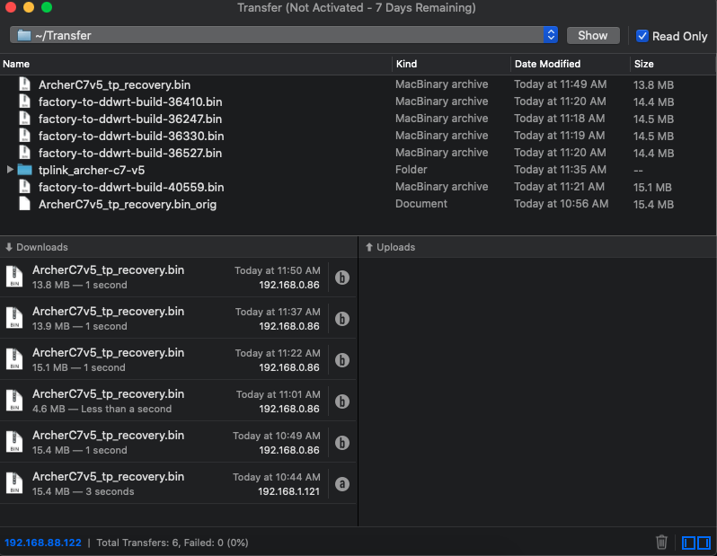
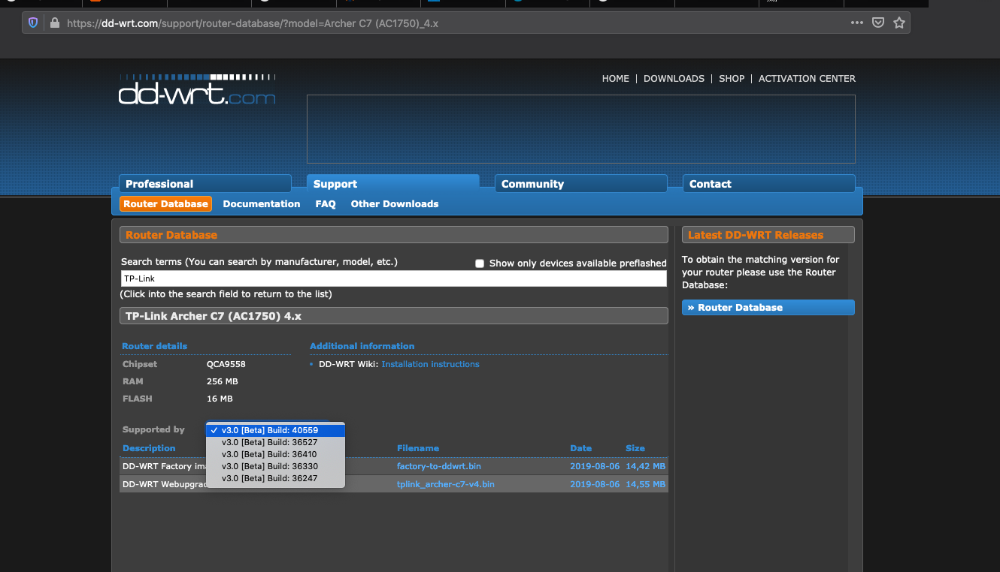
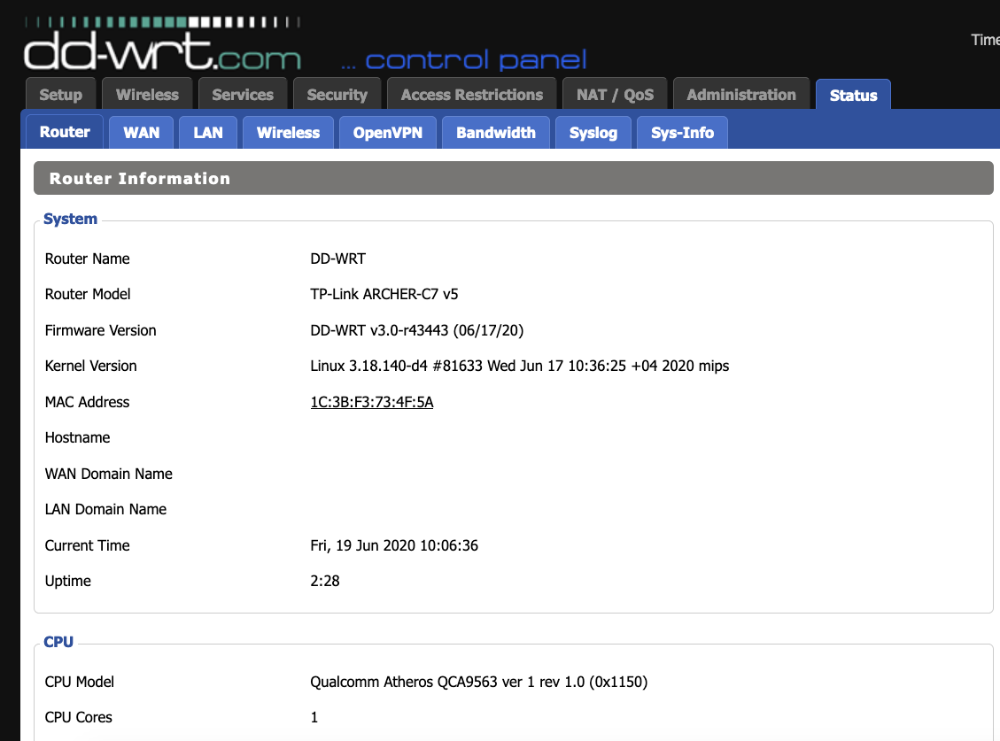
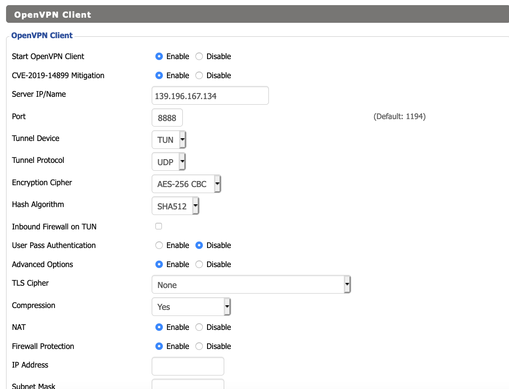
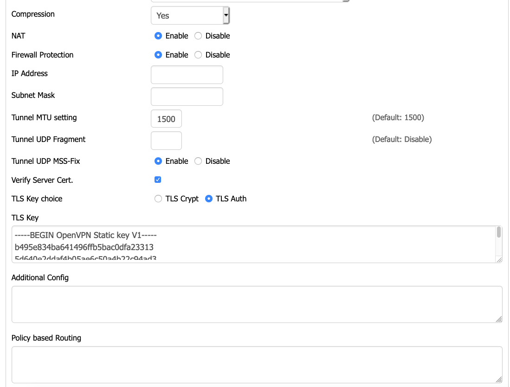
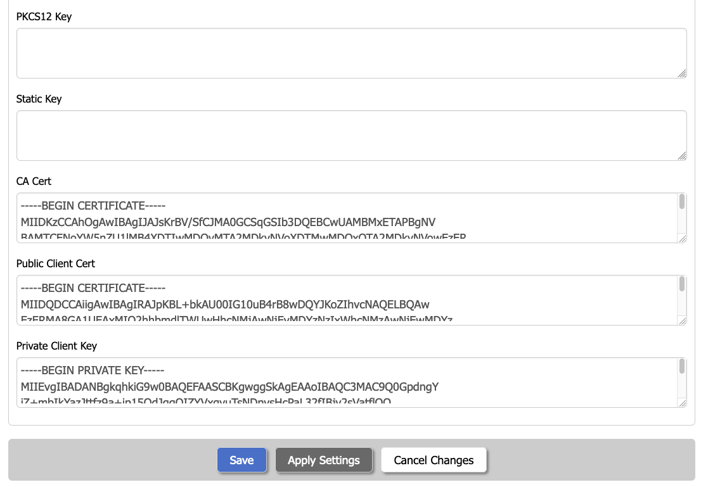
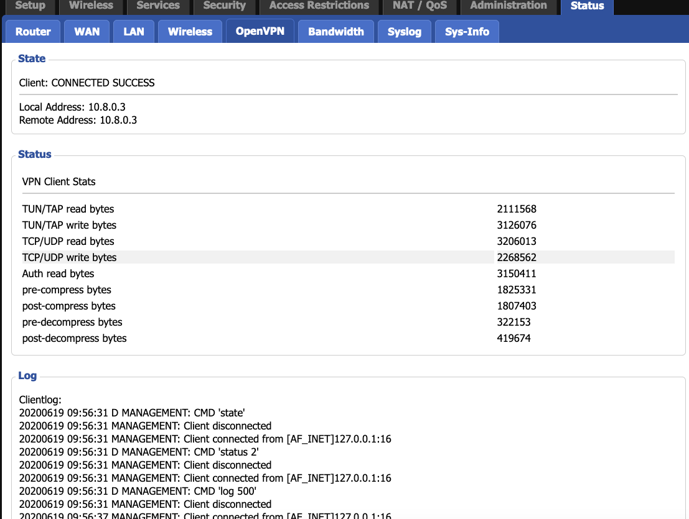

Configuration for openvpn with DD-WRT.
===

## Table of Contents

[TOC]

## Operator Guide

User story
---

Step.1 Preparing tftp server with Tranfer app.

---

Step.2 Download dd-wrt firmware.

---

Step.3 Update firmware with dd-wrt version.
       a.config pc ip with 192.168.0.66
       b.startup tftp with dd-wrt firmware.
       c.push reset button when power on within 7 ~ 10 secs.
       d.ensure the device get firmware in tftp gui.
       e.waitting for 5 mins. and then restart ap device. (please config pc ip with dhcp.)

---

Step.4 Configuration for openvpn client.

---

Step.5 Verify result.

---

